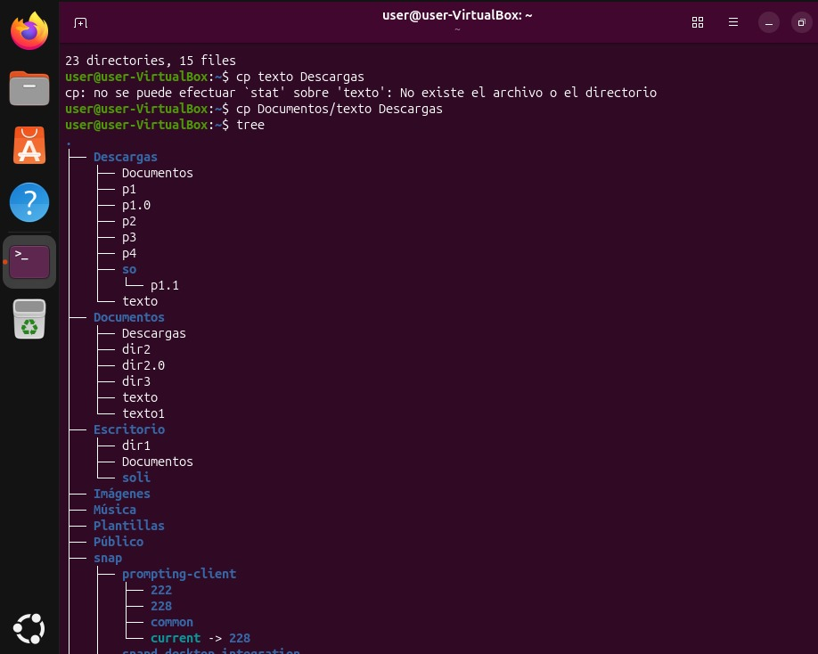
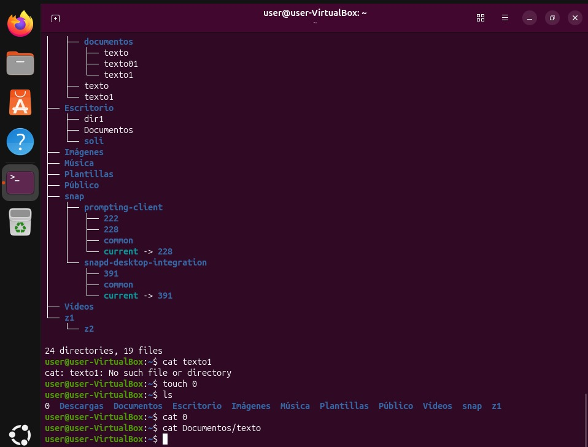

# LAB 1 – APRENDIENDO LINUX 🐧

## Introducción

En este primer laboratorio empecé a familiarizarme con el sistema operativo GNU/Linux y con el uso de la terminal. Durante la práctica aprendí y utilicé diferentes comandos básicos para trabajar con archivos y directorios.

## Actividades realizadas

Durante el laboratorio realicé prácticas utilizando la terminal de Linux. Aprendí a visualizar los archivos y carpetas del sistema, navegar entre directorios, crear archivos, copiar información y consultar el contenido de los archivos.

También practiqué la organización de archivos y directorios, utilizando diferentes comandos para conocer mejor la estructura del sistema de archivos de Linux.

## Comandos practicados

* `ls` – Permite visualizar archivos y directorios.
* `ls -l` – Muestra información detallada de archivos y directorios.
* `ls -a` – Permite visualizar archivos ocultos.
* `cd` – Permite cambiar de directorio.
* `cp` – Permite copiar archivos.
* `cat` – Permite visualizar el contenido de un archivo.
* `touch` – Permite crear archivos.
* `tree` – Permite visualizar la estructura de directorios.

## Práctica realizada

Durante la práctica utilicé comandos como `ls`, `ls -l` y `ls -a` para observar los archivos y carpetas existentes. También utilicé `tree` para visualizar de forma organizada la estructura de los directorios.

Además, practiqué la creación de archivos mediante `touch` y la visualización de su contenido con `cat`. También realicé ejercicios de copia de archivos utilizando el comando `cp`.

## Lo aprendido

Con este laboratorio pude conocer mejor el funcionamiento de la terminal de Linux y aprender algunos comandos básicos. Comprendí que mediante la terminal se pueden realizar diferentes tareas de forma rápida, como crear, copiar, visualizar y organizar archivos y directorios.

## Conclusión

Este laboratorio fue una primera experiencia práctica con GNU/Linux. Aprendí comandos básicos y empecé a familiarizarme con la terminal y la estructura de archivos. La práctica me ayudó a comprender mejor cómo trabajar en Linux y me servirá como base para continuar aprendiendo comandos y administración del sistema.
